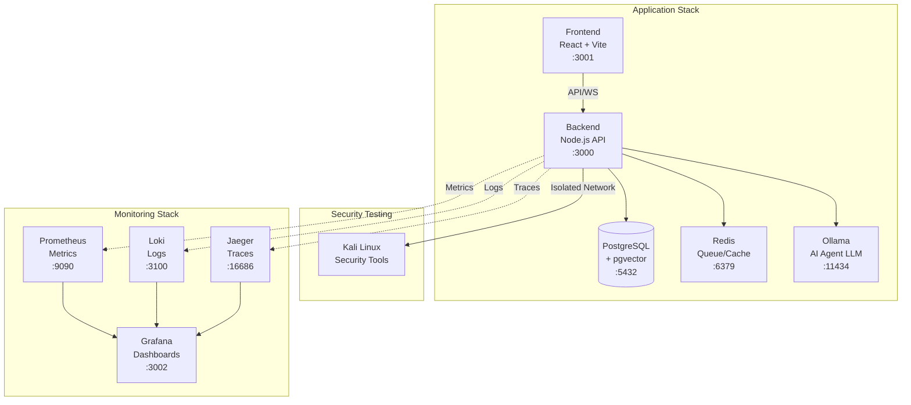
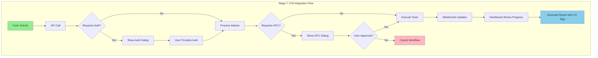

# SOC2 Compliance Testing Platform - Architecture

## Overview

The SOC2 Compliance Testing Platform is a comprehensive solution for automated security testing with compliance mapping, AI-powered intent classification, and restraint mechanisms. The platform uses Docker for containerization and includes comprehensive monitoring.

## System Architecture

### High-Level Architecture

```
┌─────────────────┐     ┌─────────────────┐     ┌─────────────────┐
│                 │     │                 │     │                 │
│    Frontend     │────▶│     Backend     │────▶│    Database     │
│   (React/TS)    │     │   (Node.js/TS)  │     │  (PostgreSQL)   │
│                 │     │                 │     │                 │
└─────────────────┘     └─────────────────┘     └─────────────────┘
                               │
                               ├──────────────────────┐
                               ▼                      ▼
                        ┌─────────────┐        ┌─────────────┐
                        │             │        │             │
                        │    Redis    │        │   Ollama    │
                        │   (Queue)   │        │(Embeddings) │
                        │             │        │             │
                        └─────────────┘        └─────────────┘
```

### Docker Architecture



## Component Details

### Frontend (Port 3001)
- **Technology**: React, TypeScript, Material-UI
- **Features**:
  - Workflow submission forms
  - Real-time progress dashboard
  - CC-tagged report viewer
  - WebSocket integration for live updates

### Backend (Port 3000)
- **Technology**: Node.js, Express, TypeScript
- **Layers**:
  1. Intent Classification (AI-powered)
  2. Context Enrichment (RAG)
  3. Trust Classification
  4. AI Agent (test generation)
  5. HITL Review
  6. Feedback Loop
- **APIs**: RESTful + WebSocket
- **MCP Server**: Tool integration

### Database (Port 5432)
- **Technology**: PostgreSQL with pgvector extension
- **Features**:
  - Vector embeddings for semantic search
  - Compliance mappings storage
  - Test results and evidence
  - Audit trails

### Redis (Port 6379)
- **Purpose**: 
  - Job queue management
  - Session storage
  - Caching layer
  - Real-time pub/sub

### Ollama (Port 11434) - Optional
- **Purpose**: Local LLM for AI agent (NOT for embeddings)
- **Models**: Configurable (llama2, mistral, etc.)
- **Integration**: AI test generation and analysis
- **Note**: Embeddings are handled by OpenAI API

### Kali Container
- **Network**: Isolated test network
- **Security**: AppArmor + Seccomp profiles
- **Tools**: nmap, nikto, ZAP, sqlmap, selenium
- **Volumes**: Results output to host

## Monitoring & Observability

### Prometheus (Port 9090)
- **Metrics**:
  - Restraint failures
  - Anomaly scores
  - API latency
  - Queue depth
  - Resource usage

### Grafana (Port 3002)
- **Dashboards**:
  - Restraint & CC Dashboard
  - System Performance
  - Compliance Coverage
  - Alert Overview

### Loki (Port 3100)
- **Log Aggregation**:
  - Application logs
  - Security test outputs
  - Audit trails
  - Error tracking

### Jaeger (Port 16686)
- **Distributed Tracing**:
  - Request flow visualization
  - Performance bottlenecks
  - Service dependencies
  - Latency analysis

## Security Architecture

### Network Isolation
```yaml
networks:
  default:      # Main application network
  isolated-test: # Isolated network for Kali tests
    internal: true
    driver_opts:
      com.docker.network.bridge.enable_icc: "false"
```

### Container Security
1. **AppArmor Profiles**: Restrict file system access
2. **Seccomp Profiles**: Limit system calls
3. **Capability Dropping**: Minimal privileges
4. **Resource Limits**: CPU/Memory constraints

### Restraint Mechanisms
1. **Authentication Required**: Blocks tests requiring credentials
2. **HITL Approval**: Human review for critical operations
3. **Anomaly Detection**: ML-based unusual behavior detection
4. **Rate Limiting**: Prevents abuse
5. **Audit Logging**: Complete trail of all actions

## Deployment

### Development
```bash
docker-compose up
```

### Production
```bash
docker-compose -f docker-compose.yml -f docker-compose.prod.yml up
```

### Key Environment Variables
- `NODE_ENV`: development/production
- `DATABASE_URL`: PostgreSQL connection
- `REDIS_URL`: Redis connection
- `OLLAMA_URL`: Local LLM service (for AI agent)
- `OPENAI_API_KEY`: OpenAI API for embeddings
- `EMBEDDING_API_URL`: Embedding service URL (defaults to OpenAI)
- `GRAFANA_ADMIN_PASSWORD`: Monitoring access

## Data Flow

1. **User submits workflow** → Frontend
2. **API processes request** → Backend
3. **Intent classification** → AI Layer
4. **Context enrichment** → RAG/OpenAI Embeddings
5. **Test generation** → AI Agent
6. **Restraint checks** → Trust Classifier
7. **Test execution** → Kali Container
8. **Results processing** → Backend
9. **Compliance mapping** → CC Tags
10. **Report generation** → Frontend

## Scaling Considerations

### Horizontal Scaling
- Backend: Multiple instances behind load balancer
- Redis: Cluster mode for high availability
- Database: Read replicas for query distribution

### Vertical Scaling
- Kali containers: Resource limits per test type
- Ollama: GPU acceleration for faster embeddings
- Database: Larger instance for vector operations

## Backup & Recovery

### Data Persistence
- PostgreSQL: Volume-mounted data directory
- Redis: AOF persistence enabled
- Monitoring: Time-series data retention policies

### Disaster Recovery
1. Database backups: Daily automated snapshots
2. Configuration: Version controlled in Git
3. Secrets: External secret management
4. Logs: Centralized with retention

## Compliance & Audit

### SOC2 Mappings
- **CC6.1**: Logical and physical access controls
- **CC6.2**: Prior to issuing system credentials
- **CC6.3**: Internal and external threats
- **CC6.6**: Intrusion detection
- **CC6.7**: Security incidents
- **CC6.8**: Vulnerability assessments

### Audit Features
1. Complete test execution logs
2. Compliance control evidence
3. User action tracking
4. System change history
5. Performance metrics
6. Security incident records

## Stage 7 Integration Flow Diagram



This diagram illustrates the complete restraint flow including authentication requirements, HITL approval paths, and the full workflow from submission to CC-tagged report generation.